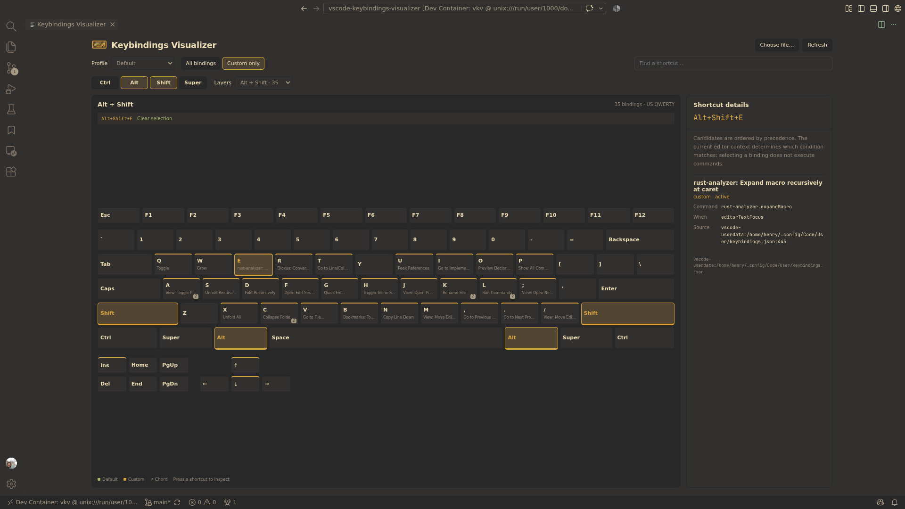

# Keybindings Visualizer

Explore VS Code's default and custom keyboard shortcuts on an interactive US QWERTY keyboard. Select modifier layers, inspect commands and conditions, and find your custom shortcuts without opening JSON editor tabs with live updates.

Run **Keybindings Visualizer: Open** from the Command Palette to open

